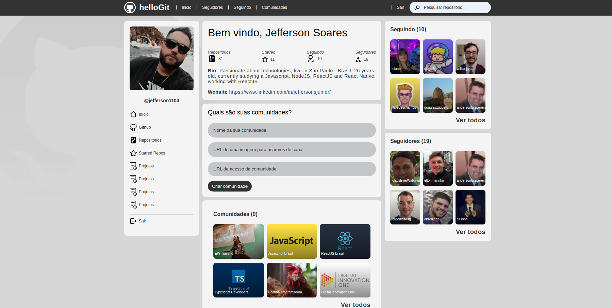
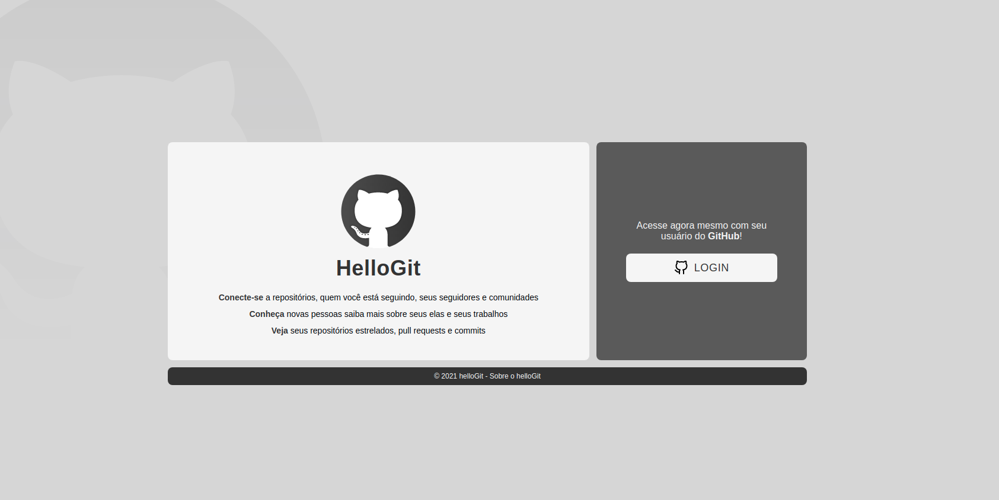
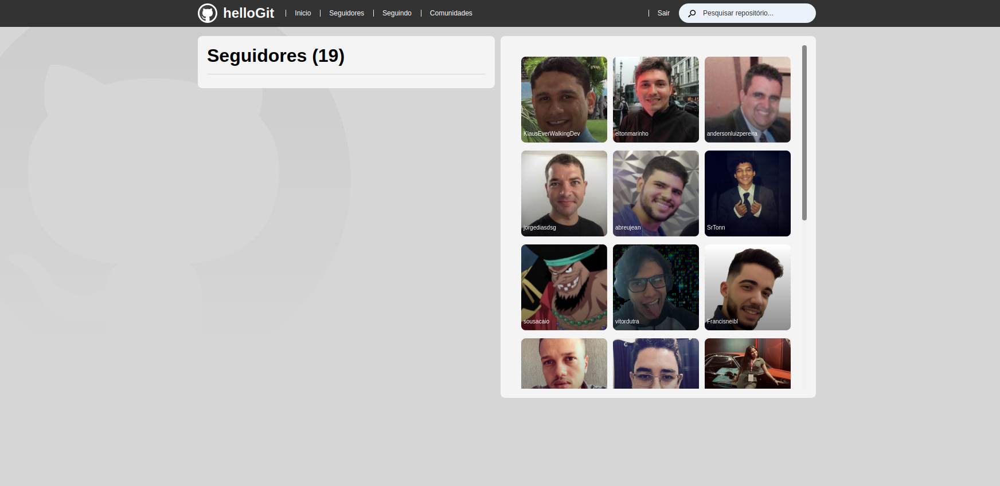
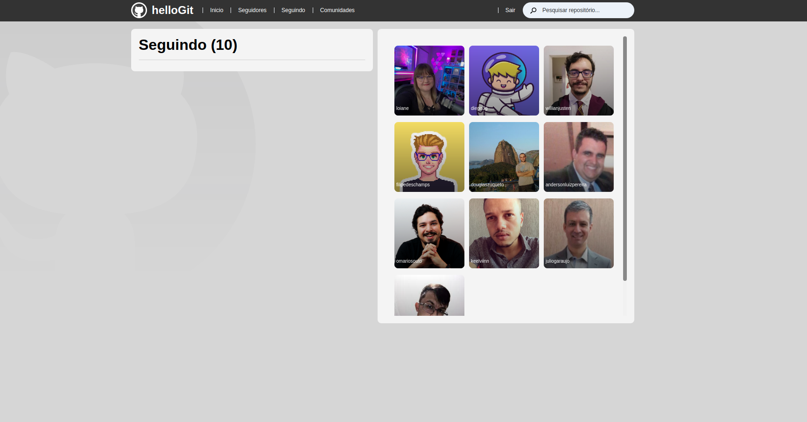
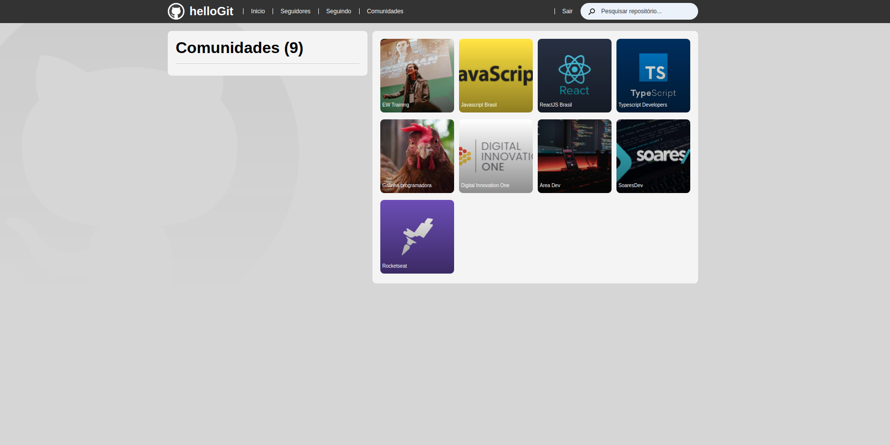

<div align="center">
  
  <h1>helloGit</h1>
  <br />
  <p align="center">
    
    
    
    
  </p>
</div>

# :memo: About this project

**helloGit** is a social network for github users, the base of its development was with javascript and the NextJS framework, we also use several technologies in the construction of the application, such as the provider manager for NextAuth authentication, hooks and features like useEffect, useState, Server Side Rendering were used in this project.

<div align="center">
  
</div>

# :rocket: Main technologies
<ul>
  <li><a target="_blank" href="https://devdocs.io/javascript/">Javascript</a></li>
  <li><a target="_blank" href="https://pt-br.reactjs.org/">ReactJS</a></li>
  <li><a target="_blank" href="https://nextjs.org/">NextJS</a></li>
  <li><a target="_blank" href="https://styled-components.com/">Styled-components</a></li>
  <li><a target="_blank" href="https://graphql.org/">GraphQL</a></li>
  <li><a target="_blank" href="https://www.datocms.com/">Dato CMS</a></li>
  <li><a target="_blank" href="https://next-auth.js.org/">NextAuth</a></li>
</ul>

# :cyclone: How to run this project
```bash
# Clone this repository
$ git clone https://github.com/jefferson1104/helloGit-nextjs.git

# Access directory project
$ cd hellogit-nextjs
$ code . 

# Configure .env.local variables in your Github OAuth Apps
https://github.com/settings/developers

# Install project dependencies using yarn package manager
$ yarn

# Or run the project locally http://localhost:8000
$ yarn dev
```

# 🎨 Screenshots
<p align="center">
  
  
  
  
  
</p>
